<!-- Place this tag in your head or just before your close body tag. -->

    <!-- star -->
    <a class="github-button" href="https://github.com/codycodes/iot-Porg-makerfaire/" data-icon="octicon-star" data-color-scheme="no-preference: light; light: light; dark: light;" data-size="large" aria-label="Star codycodes/iot-Porg-makerfaire on GitHub">Star</a>
    <!-- download -->
    <a class="github-button" href="https://github.com/codycodes/iot-Porg-makerfaire/archive/master.zip" data-icon="octicon-cloud-download" data-size="large" aria-label="Download codycodes/iot-Porg-makerfaire on GitHub">Download</a>
    <!-- issue -->
    <a class="github-button" href="https://github.com/codycodes/iot-Porg-makerfaire/issues" data-color-scheme="no-preference: light; light: light; dark: light;" data-size="large" aria-label="Issue codycodes/iot-Porg-makerfaire on GitHub">Issue</a>

## About
The NodeMCU is an open-source firmware and development kit which allows us to use a low-cost ESP8266 WiFi MCU to provide “the best platform for IOT application development at the lowest cost” [NodeMCU homepage](https://www.nodemcu.com/index_en.html).  

ESPHome is the software and firmware flasher we’ll be using; it’s a “system to control your ESP8266/ESP32 by simple yet powerful configuration files and control them remotely through Home Automation systems” [ESPHome homepage](https://esphome.io).

**Table of Contents**
- [About](#about)
- [Upon Completion](#upon-completion)
- [Materials](#materials)
  - [Required](#required)
  - [Optional](#optional)
  - [Preferred](#preferred)
- [Guide](#guide)
  - [General Instructions](#general-instructions)
  - [Option 1: Hacking the Porg (keeping batteries and using relay 🔋)](#option-1-hacking-the-porg-keeping-batteries-and-using-relay-)
  - [Option 2: Hacking the Porg (USB power and no relay 🔌)](#option-2-hacking-the-porg-usb-power-and-no-relay-)
  - [ESPHome (local) Instructions](#esphome-local-instructions)
  - [Azure IoT Hub (remote) Instructions](#azure-iot-hub-remote-instructions)
- [Contributing](#contributing)

## Upon Completion
By completing this project you will have a Porg or other hacked interactive 5v plush which can be invoked via web request over the Internet! There are a couple options that you can choose to take as well, including:

1. Soldering the Porg's battery terminals and using the NodeMCU to power it instead (Look ma, no batteries!)
2. Avoid using a relay and use the NodeMCU as the interface when the Porg's button is pressed (Allows you to use the button on the Porg as a Smart Button)

It is *your* choice on what you wish to do with this project! The options above have some tradeoffs which are dicsussed in the section below. 

We've included some fun ideas at the end for things we're doing with them. Please feel free to message us with any ideas you've come up with as well at [ibelieveinporg@cody.codes](mailto:ibelieveinporg@cody.codes)

As of 5-16-20, you can [buy a Porg from Amazon for about $25 (including tax)](https://amzn.to/2WFhYfX)!

    <iframe src="https://giphy.com/embed/BpCYzidFkPgUzFV9cA" width="480" height="201" frameBorder="0" class="giphy-embed" allowFullScreen></iframe>
<a href="https://giphy.com/gifs/starwars-star-wars-the-last-jedi-BpCYzidFkPgUzFV9cA">via GIPHY</a>

## Materials

### Required
 - [Long, small philips head screwdriver](https://amzn.to/36iYAbQ) (NOTE: I didn't buy this so I would hope it works; the one I use is a "#1" Philips head. Regardless, you'll need a long, thin philips head screwdriver with the right size to be able to get the screws out from the back)
 - [Porg](https://amzn.to/2WFhYfX)
 - [NodeMCU](https://amzn.to/3cKYa0g)
 - [USB Micro **data** Cable](https://amzn.to/2zUJjBC) (you may have some of these lying around)
 - Desktop/laptop computer to flash the NodeMCU
 - Soldering iron
 - Solder
 - Wire

### Optional
 - [5V Relay](https://amzn.to/3etcpGS) If intending to keep Porg's original battery-powered functionality intact. Otherwise if you'll be keeping this powered via USB it's not necessary.
 - Drill to make a hole in the battery compartment for the porg (only for the non-relay option)

### Preferred
 - 5V LED or Multimeter to test circuit
 - Solder flux and applicator (toothpick works)
 - Solder tip cleaner
 - Hot glue
 - Wire cutters
 - Small wire or DuPont Wires
 - Heat shrink small enough for wire
 - Electrical tape

## Guide
There are two different approaches you can take to hacking your Porg! The first requires a relay and allows you to continue to use the core functionality of the Porg, which is to have it battery powered and not require the ESP8266 to be plugged in for it to work. Unfortunately the power consumption of the Porg running on batteries means it's prone to fail unexpectedly, so instead we recommend going with option 2, which is allows the Porg to function via USB power completely, but sacrifices its ability to function normally when it's not plugged in. It also doesn't require a relay to run, and will save you the cost of batteries. Also with option 2, you can then use the button as a GPIO input to the Porg, which allows you to unleash the full Internet of Porg potential!

> NOTE: If you're going with option 2 (USB Power), you should NOT have batteries connected to the Porg ever! It may damage and break your ESP8266 and/or your Porg!

> DISCLAIMER: We are not responsible in any way shape or form if you encounter problems by following this guide. Follow this guide at your own risk!

### General Instructions
These are the general instructions which you'll follow with both methods (relay/no relay); at the appropriate time you can choose either option 1 or option 2, depending on what materials you have and which outcome you want.

1\. Unscrew the battery compartment and remove the batteries from the device. Then, cut the ziptie shown here:
  

  <!-- make the following images centered -->
  
  

2\. Scrunch up the Porg and you'll find four screws in the back; unscrew them using the extra long philips screw driver.
  

  
  
  

3\. You can now pry the sides of the bottom out which will pop open the internals; who knew this is what a Porg looks like on the inside?!
  

  
  
  

4\. Use wirecutters to snip the light blue wires which are attached to the button. Leave **plenty** of room from the circuitboard of the Porg to the wires. Then snip off the insulation from the wire so that the bare copper wire is showing. Be careful! It's easy to take all the insulation off so hold the bottom of the wire which is attached to the circuitboard with your hand while you pull the top part off.
  

  
  

### Option 1: Hacking the Porg (keeping batteries and using relay 🔋)

5\. The basic idea is that we'll be soldering to the button wires, which are used to activate the Porg. In order to keep the button presses working, we will simply "extend" the button to the Node MCU. Then the NodeMCU will also have the ability to simulate a button press, which will then activate the relay and complete the circuit, thus activating the Porg! The circuit diagram for this and the soldering afterwards is as follows:
  

  
  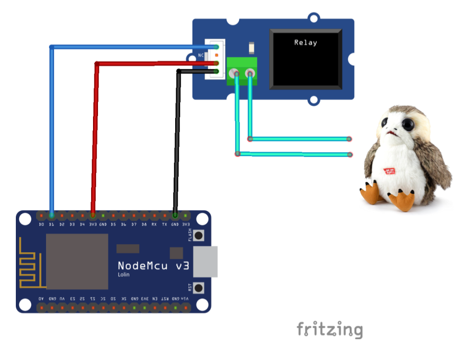
  

  Note! Please keep in mind that these wires are colored Cyan which denotes the button's wires. 

6\. Wire up the relay as according to the circuit diagram and solder it in. Now that it's soldered in, you should hot glue the connections to the board and the wires to ensure that the connections stay connected. You can use electrical tape in addition to keep the wires isolated. 
  

  
  

7\. Before stuffing the electronics back in, test to ensure the code works. Follow [this guide](https://cody.codes/gix-mkrfridays-iot/#software-setup) for info, but use the `porg.yaml` instead of `servo.yaml`. Make sure your Porg is switched to the ON position! After you confirm the Porg works from software, stuff the electronics back into the Porg, minding the wires. It is definitely more challenging to fit a relay and NodeMCU back in!
  
****
  
  

8\. You can pry the sides apart to fit the battery compartment back in. Rescrew the four screws in the back and the battery case back on. While it may not fit perfectly, there is enough room for the cable to come out and the Porg to still look like it's sitting fine!
  

  
  
  

### Option 2: Hacking the Porg (USB power and no relay 🔌)

In this example we will be building the following circuit, in which we solder directly to the NodeMCU's pins for the Porg's button input, squawk activator, and for powering the Porg via the USB cable plugged into the NodeMCU:
  

  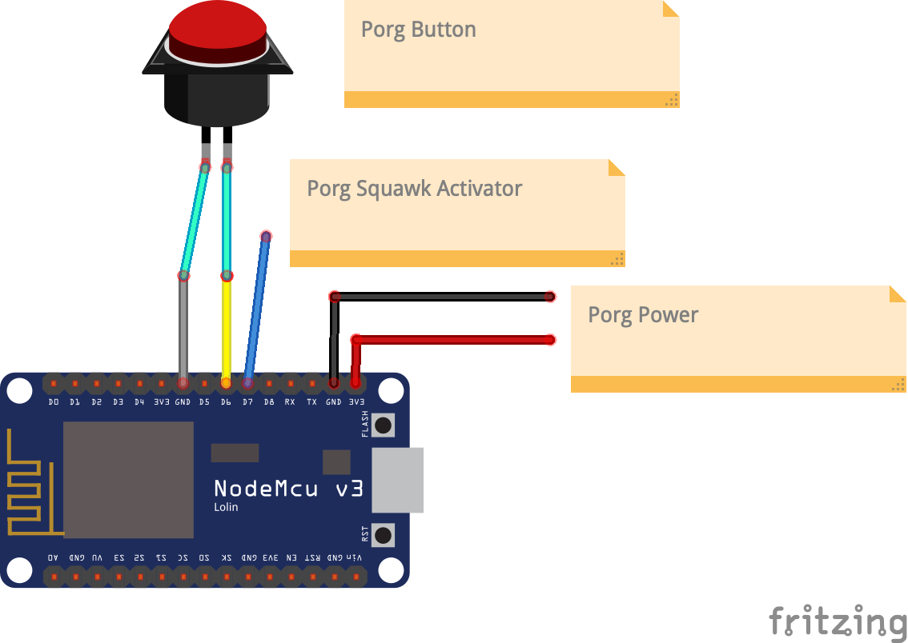
  

5\. The first step is to ensure that the batteries are removed and will not be added back to the Porg; adding the batteries back in after we have power via USB can be dangerous. In the next step you can simply remove the battery terminals connection and instead solder the connections directly to the NodeMCU.
  

  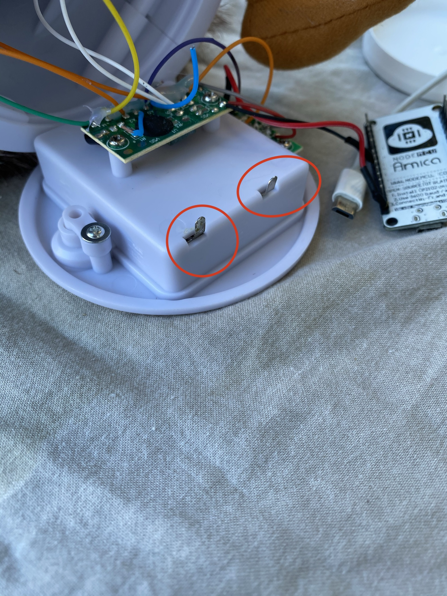
  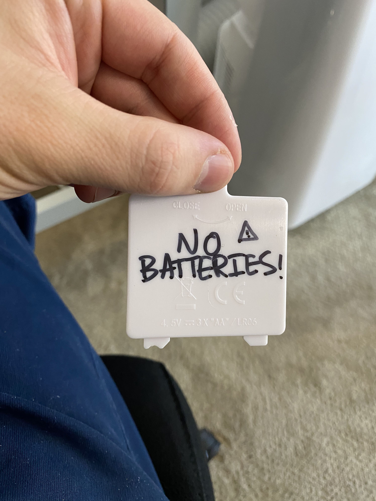
  

6\. The next step is to solder the battery terminals to receive power input from the NodeMCU. Everything must be grounded to the NodeMCU for this to work. You will also ground one of the button wires to the NodeMCU; since all ground pins are connected on a ground plane inside the NodeMCU, The points solder are indicated by the red/black wires in the picture. You want to connect the RED wire to a 3.3V pin on the NodeMCU and a black wire to the GND pin. Something that makes soldering to these pins easier is using flux and potentially bending the pin away from the other pins. See pictures for details (NOTE since my red wire was pretty small and I wanted to get the Node MCU to the larger side of the plastic area I actually lengthened the red wire by soldering to the circuit circuit pad on the switch of the Porg):
  

  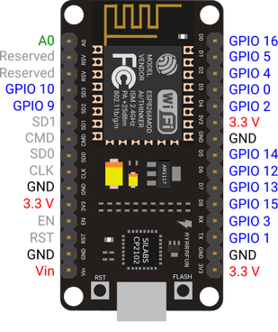
  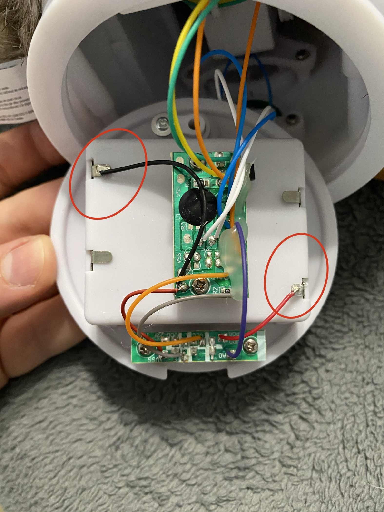
  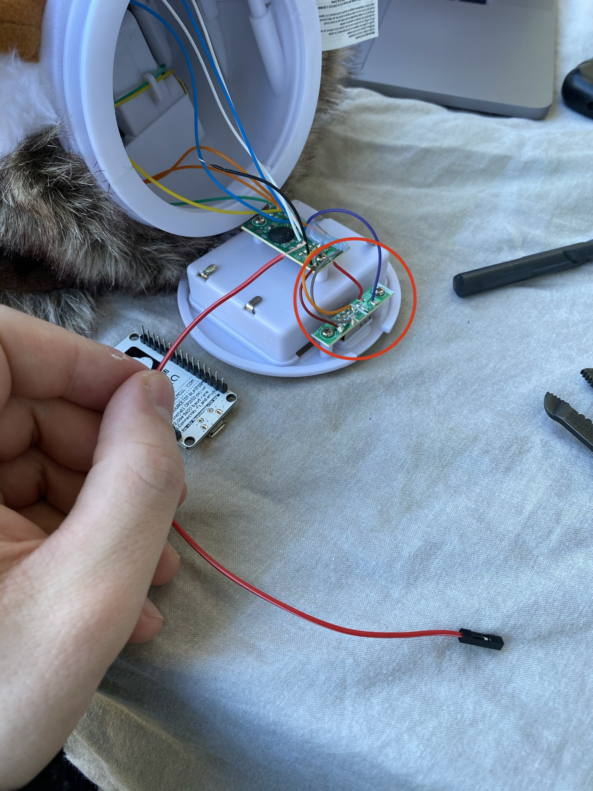
  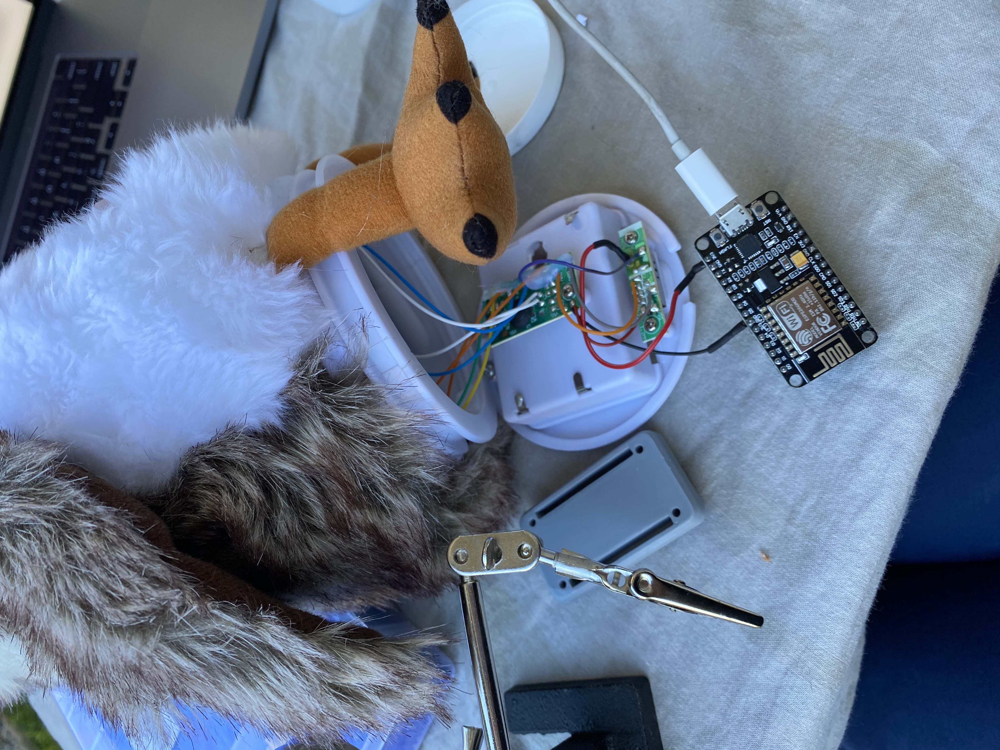
  

7\. Now we need to solder the button wires to the NodeMCU. There are two light blue wires coming from the Porg which need to be cut and stripped, and belong to the button (take care not to cut the speaker's wires!):
  

  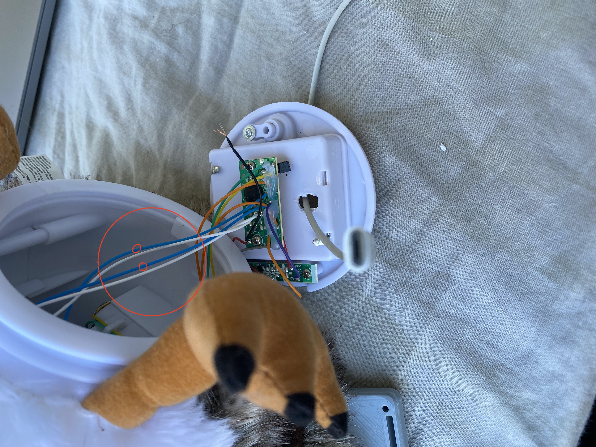
  

8\. Now that those wires are cut and stripped, one of them (either) should go to any of the available GND pins on the NodeMCU, and the other should be connected to pin D6 on the board, or referred to in software as GPIO 12. Using the flux helps with soldering to the the pins. Please refer to the above circuit diagram for understanding the wiring.

9\. Now we need to do essentially the same thing in cutting and stripping two blue wires, but for the two blue wires that are connected to the bottom PCB of the Porg. If you have female DuPont wires that may make it easier to test as seen in the picture as the next steps will require testing which wire is the receiving squawk activator wire and which is an always on wire.
  

  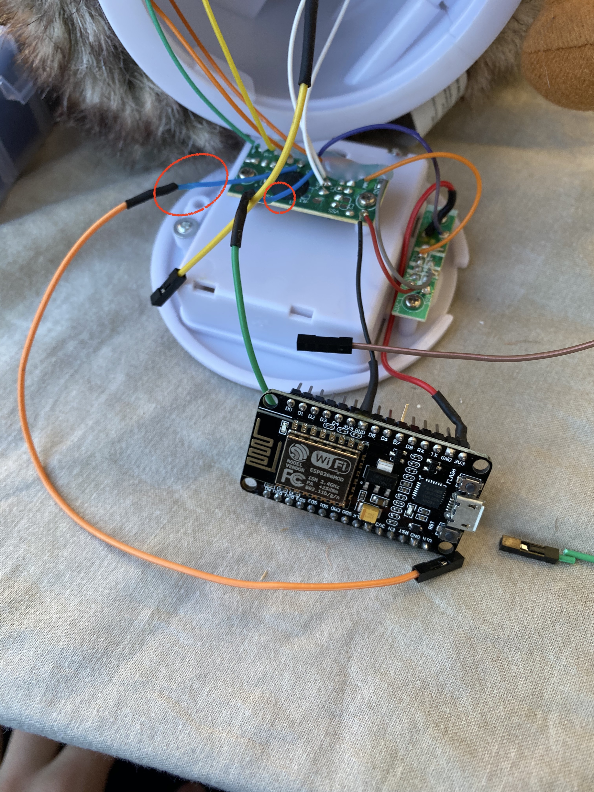
  

10\. We will be using the GPIO of the NodeMCU to read the button press of the porg, and then use another GPIO to trigger the Porg. In order to do this we must use the correct wire from the Porg which we can determine by using either an LED or a multimeter. Essentially we will only use the wire that *doesn't* light up the LED; this is the wire that waits for the signal on the GPIO. See the pictures to see our setup, but again know that the wire that lights the LED is the wire you don't want to use! The other wire that doesn't light up the LED *is* the one that you want to solder to pin D7 or GPIO 13. Remember that the longer end an LED is the positive side; that should always be touching *one* of the blue wires from the PCB; the other should be attached to the ground:
  

  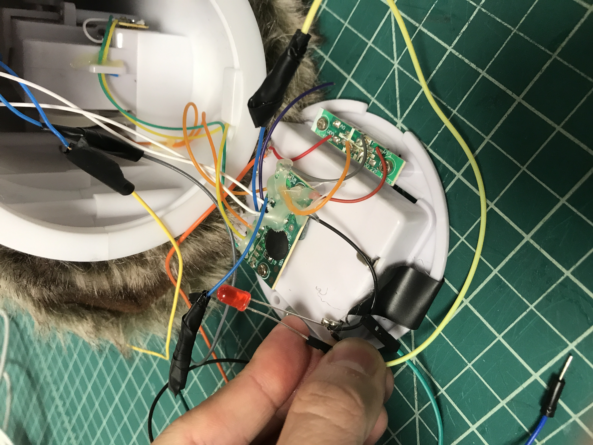
  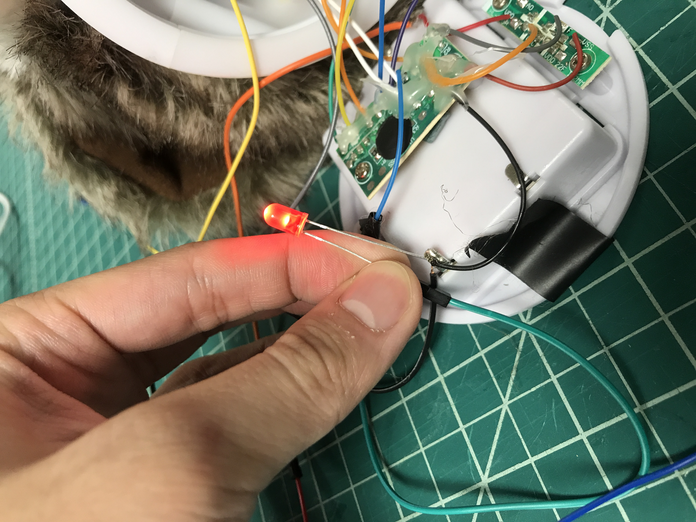
  

11\. Once you know the wire that doesn't turn on the LED, you can solder it to pin D7/GPIO 13 on the NodeMCU. At this point you can load up the code referred to earlier and test it out! You should now have a working porg that you press the button and it squawks, but is now controlled by the NodeMCU! Check the below section for fun ideas you can use the Porg for!

12\. Another thing you can do at this point is to drill a hole in the battery compartment so that you can stick the USB cable through the battery compartment. Be very careful when doing this as the wires that are connected to the porg could easily be ripped by the torque of the drill. Hold it tightly and don't let the drill spin the battery compartment! You'll also need a large bit for this that fits to the head of your USB. The other option is just to let the wire stick out where possible on the back of the Porg.
  

  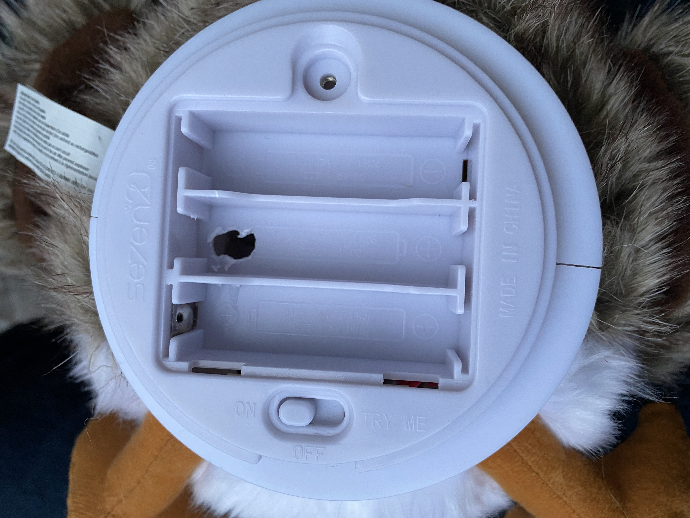
  

13\. At this point the only thing left to do is shove things back in and rescrew the back! It might be good to put some electrical tape onto the PCBs to prevent shorts. Also be careful when putting it back together to put it into a place where it's less likely to interfere with the motors on the Porg.

Congratulations, your Porg can now be automated! 👏👏👏 

You can quickly test your Porg using the Arduino sample files in this repo (under the `src` directory). Once you know it's working, feel free to move to the more feature rich deployments outlined below!

### ESPHome (local) Instructions

Follow the setup guide at [this link](https://cody.codes/gix-mkrfridays-iot/#software-setup) and use the `porg-no-relay.yaml` configuration file. After your board is flashed follow the instructions for general usage.

### Azure IoT Hub (remote) Instructions

Follow the setup guide at [this link](https://github.com/codycodes/gix-mkrfridays-iot#remote-control-via-azure-iot-hub); please note that you will need an Azure account and to deploy the cloud infrastructure first; if you're just getting started, it's recommended to try ESPHome for the fastest/easiest setup!

## Contributing
Just click the "fork" button, make your changes, and open a pull request! If you need any help please ask :).