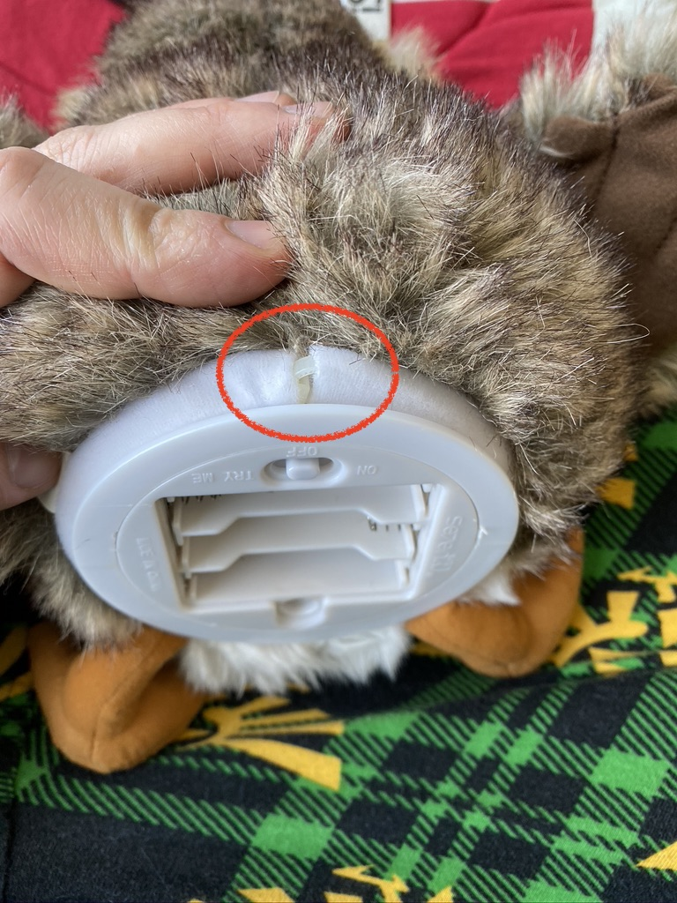
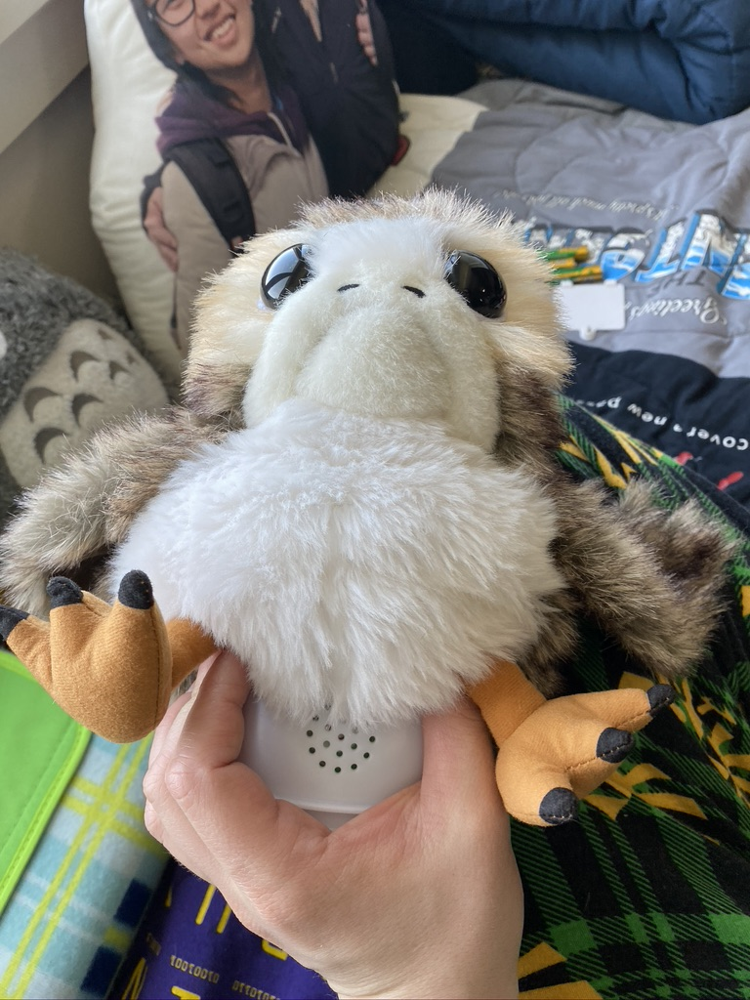
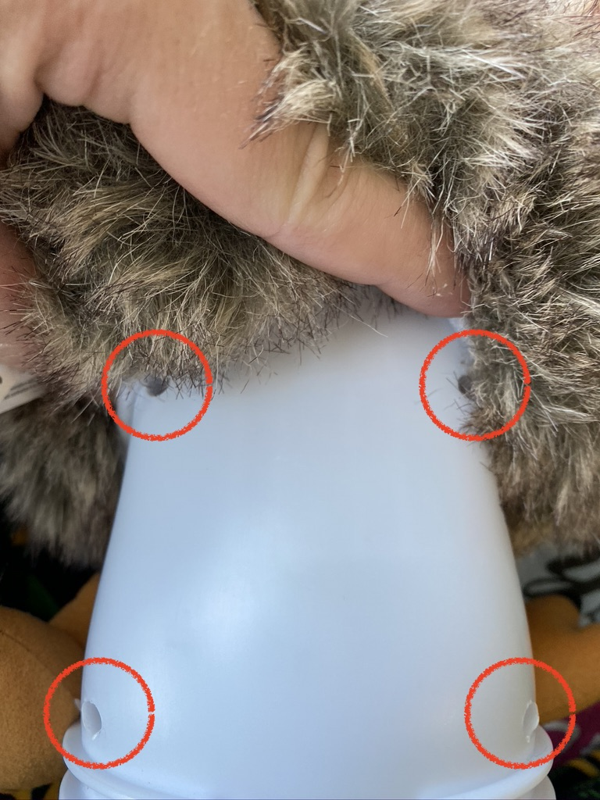
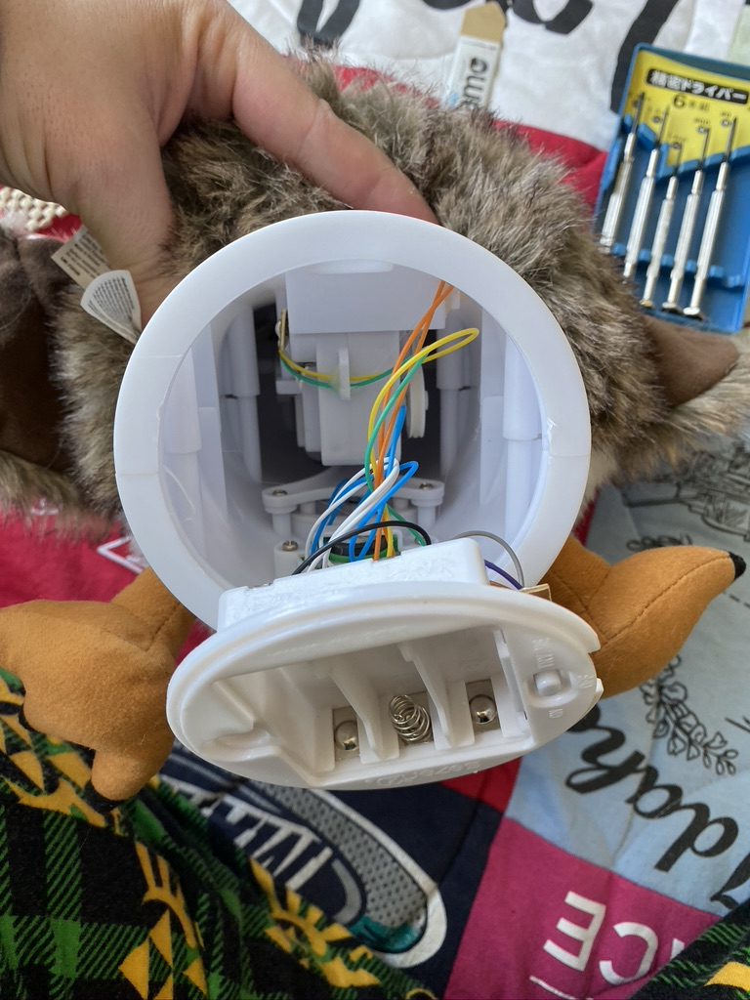
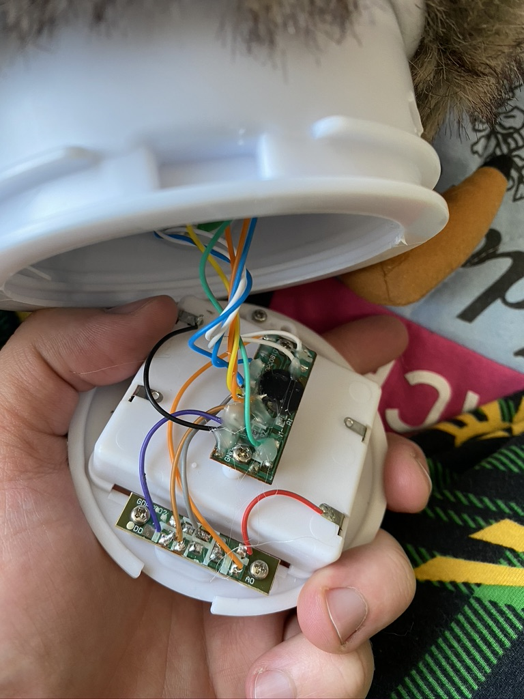
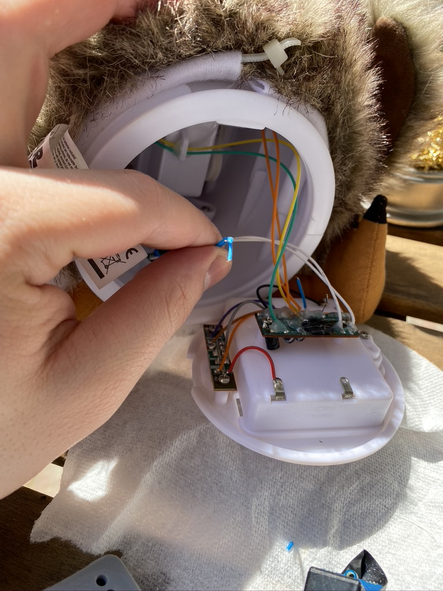
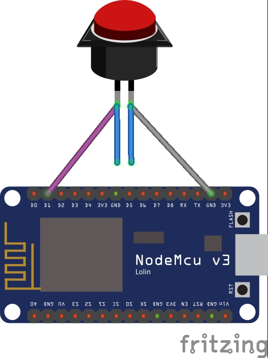
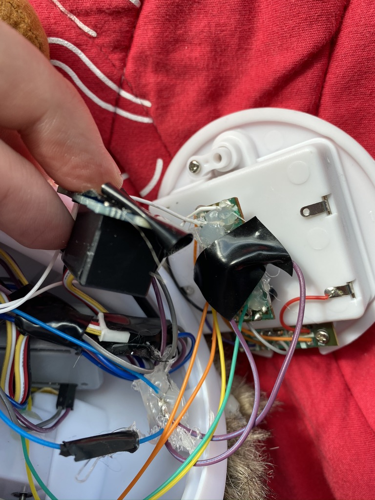
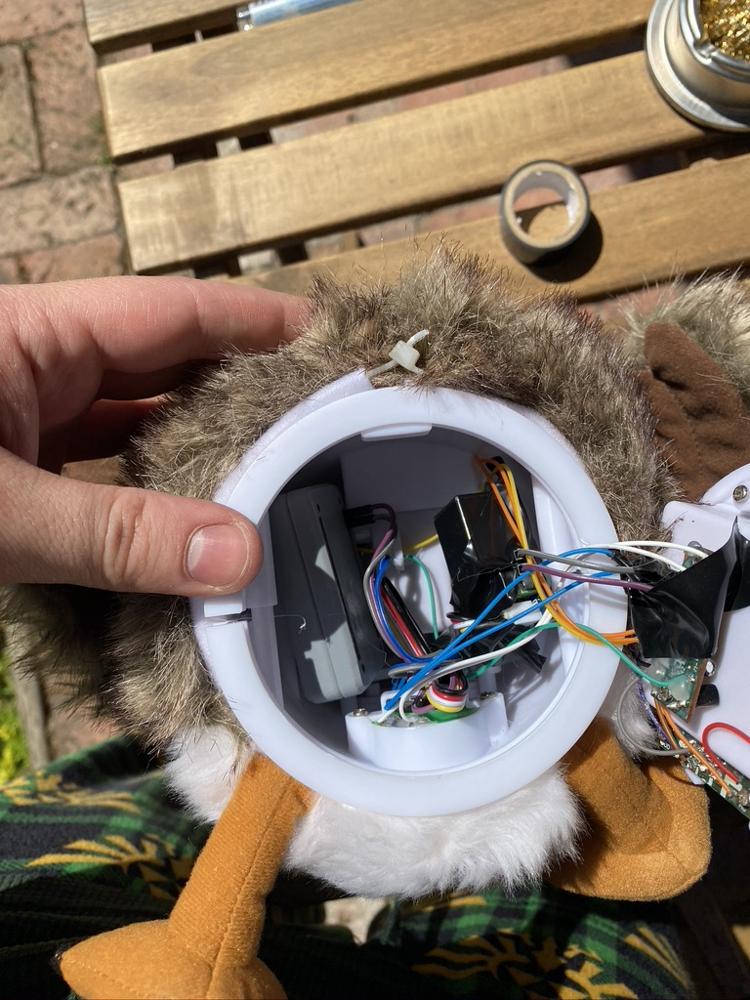
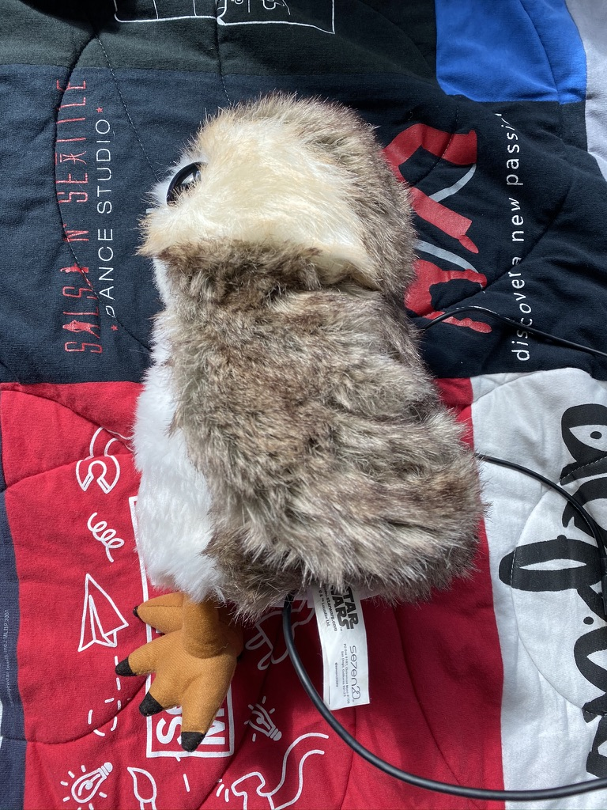

<!-- Place this tag in your head or just before your close body tag. -->

    <!-- star -->
    <a class="github-button" href="https://github.com/codycodes/iot-porg-makerfaire/" data-icon="octicon-star" data-color-scheme="no-preference: light; light: light; dark: light;" data-size="large" aria-label="Star codycodes/iot-porg-makerfaire on GitHub">Star</a>
    <!-- download -->
    <a class="github-button" href="https://github.com/codycodes/iot-porg-makerfaire/archive/master.zip" data-icon="octicon-cloud-download" data-size="large" aria-label="Download codycodes/iot-porg-makerfaire on GitHub">Download</a>
    <!-- issue -->
    <a class="github-button" href="https://github.com/codycodes/iot-porg-makerfaire/issues" data-color-scheme="no-preference: light; light: light; dark: light;" data-size="large" aria-label="Issue codycodes/iot-porg-makerfaire on GitHub">Issue</a>

## About
The NodeMCU is an open-source firmware and development kit which allows us to use a low-cost ESP8266 WiFi MCU to provide “the best platform for IOT application development at the lowest cost” [NodeMCU homepage](https://www.nodemcu.com/index_en.html).  

ESPHome is the software and firmware flasher we’ll be using; it’s a “system to control your ESP8266/ESP32 by simple yet powerful configuration files and control them remotely through Home Automation systems” [ESPHome homepage](https://esphome.io).

## Upon Completion
By completing this project you will have a porg or other hacked interactive 5v plush which can be invoked via web request over the Internet!

As of 5-16-20, you can [buy a Porg from Amazon for about $25, including tax](https://amzn.to/2WFhYfX)!

    <iframe src="https://giphy.com/embed/BpCYzidFkPgUzFV9cA" width="480" height="201" frameBorder="0" class="giphy-embed" allowFullScreen></iframe>
<a href="https://giphy.com/gifs/starwars-star-wars-the-last-jedi-BpCYzidFkPgUzFV9cA">via GIPHY</a>

## Materials

  ### Required
 - [Long, small philips head screwdriver](https://amzn.to/36iYAbQ) (NOTE: I didn't buy this so I would hope it works. You need a long, thin philips head screwdriver)
 - [Porg](https://amzn.to/2WFhYfX)
 - [NodeMCU](https://amzn.to/3cKYa0g)
 - [USB Micro **data** Cable](https://amzn.to/2zUJjBC) (you probably have some of these lying around)
 - Desktop/laptop computer to flash the NodeMCU
 - Soldering iron
 - Solder

  ### Preferred
 - [3D printed NodeMCU case](https://www.thingiverse.com/thing:2786523) (can also use electrical tape)
 - Hot glue
 - Wire cutters
 - Electrical tape
## Setup
### Hacking the porg

1\. Unscrew the battery compartment and remove the batteries from the device. Then, cut the ziptie shown here:
  

  <!-- make the following images centered -->
  
  

2\. Scrunch up the Porg and you'll find four screws in the back; unscrew them using the extra long philips screw driver.
  

  
  
  

3\. You can now pry the sides of the bottom out which will pop open the internals; who knew this is what a Porg looks like on the inside?!
  

  
  
  

4\. Use wirecutters to snip the light blue wires which are attached to the button. Leave **plenty** of room from the circuitboard of the porg to the wires. Then snip off the insulation from the wire so that the bare copper wire is showing. Be careful! It's easy to take all the insulation off so hold the bottom of the wire which is attached to the circuitboard with your hand while you pull the top part off.
  

  
  

5\. The basic idea is that we'll be soldering to the button wires, which are used to activate the porg. In order to keep the button presses working, we will simply "extend" the button to the Node MCU. Then the NodeMCU will also have the ability to act as a button press, completing the circuit and activating the Porg! The circuit diagram for this and the soldering afterwards is as follows:
    

    
    
    

6\. Now that it's soldered in, you should hot glue the connections to the board and the wires to ensure that the connections stay connected. You can use electrical tape if you'd like instead. These are meant to keep the wire connections isolated from each other and the boards.
  

  
  

7\. Stuff the electronics back into the Porg, minding the wires.
  

  
  

8\. You can pry the sides apart to fit the battery compartment back in. Rescrew the four screws in the back and the battery case back on. While it won't fit perfectly, there is enough room for hte cable to come out and the porg to still look like it's sitting fine!
  

  
  
  

Congratulations, your porg can now be automated! 👏👏👏 

### ESPHome (local) flashing instructions
<!-- These will be updated -->
Follow the dev environment guide at [this link](https://cody.codes/gix-mkrfridays-iot/) but use the `porg.yaml` file instead of `servo.yaml`. After your board is flashed follow the instructions for general usage.

### TODO: Azure IoT Hub
In progress and coming soon!

# Project overview - Just for those working on the project!
# Minimum Project Scope

It's worth noting that all tasks will be directly beneficial to the GIX IoT Network project and not just the MakerFaire attendees and external makers!

## Emoji Guide
💯 = Must do to complete project  
💭 = Nice but can work without it  
⚠️ = Nice but could pose significant time suck and can work without it

## Time
* Arduino Development: 2 - 10 hrs depending on path taken
  * 💯Figuring out the issue for uploading code to NodeMCU by needing to change file (see the [repo](https://github.com/Azure/azure-iot-arduino))
    * 💯Documentation 
    * 💭Automation script Linux/Unix
      * ⚠️ Being able to do this on Windows in addition to Linux/Unix - developing a cross-platform Python script
* Azure Development: 2 - 10 hrs depending on path taken
    * 💯Documentation on process
    * 💭ARM template which is able to orchestrate creation of all resources 
      * Function App
      * Azure IoT Hub
      * IoT Device
      * 💭Key Vault + add documentation to add Key

* 💯Submission to MakerFaire: 2 hrs
  * 💯 writeup on make projects https://makeprojects.com/

* 💭Submisison to Instructbles Arduino contest 2 hrs:
  * https://www.instructables.com/contest/arduino2020/

* 💯 Shifts @ MakerFaire: 1 - 8 hrs
* 💭 Add this project to GIX's GitHub?: 1 hr

**ESTIMATED TOTAL (AVG time to complete everything): 17 hrs**

## Resources/Value Upon Completion
💯Arduino device code which can be configured for Wi-Fi in Arduino IDE and can be *easily* flashed by anyone (instructions or automated):
* 💯 Could be solely documentation
* ⚠️ Or it could use the Arduino IDE in conjunction with a python shell script (see the [Arduino CLI](https://github.com/arduino/arduino-cli) project).

💭Depoloyable ARM template on Azure which allows anyone to deploy the following resources:
* Function App
* Azure IoT Hub
* IoT Device

And let's not forget, another cool GIX project!
## TODO and Delegation
Each emoji represents one or two people:

☁️= Cloud Engineers (two people)  
🔎= Researcher (one person)  
🤖= Systems Engineers (two people)  
📜= Technical Writers (two people)  
👔= Presenters (one to four people)  
🧪= Testers (three people)

- [ ] ARM Template (three people) - Justin, Joey, Cody
  - [ ] 🔎Get high level resource templates for Function App, Azure IoT Hub, and IoT Device.
  - [ ] 🔎Learn Deployment Manager for ARM Templates  
  - [ ] ☁️[Learn Basic Structure of ARM template](https://docs.microsoft.com/en-us/azure/azure-resource-manager/templates/overview)
  - [ ] ☁️Sign up for Azure
  - [ ] ☁️[Create a sample ARM template](https://docs.microsoft.com/en-us/azure/azure-resource-manager/templates/template-tutorial-create-first-template?tabs=azure-powershell)
  - [ ] ☁️[Azure IoT Hub ARM template sample](https://azure.microsoft.com/en-us/resources/templates/?term=iothub)

- [ ] Arduino Flashing (two people) - CJ, Cody
  - [ ] 🤖Figure out uploading the code to Arduino on multiple platforms (Windows/Linux/Unix) and create documentation including entering Wi-Fi SSID + password and adding code config 
  - [ ] 🤖Write a python script to automate changing the files for *Linux/Unix*
  - [ ] 🤖EXTRA: Automate the process on Windows as well and use the [Arduino CLI](https://github.com/arduino/arduino-cli) project

- [ ] Submission of Projects (two people) (Yun, Chuck, Ke)
  - [ ] 📜Create GIX account on [Make Projects](https://makeprojects.com/)
    - [ ] 📜Category: Re-thinking the Future - How the pandemic and our response to it is teaching us to think differently. How, where and why we do things. Sustainability. Food. Well-being.
  - [ ] 📜Document process and add in images and other content for Make Projects
  - [ ] 📜Create GIX account on Instructables
  - [ ] 📜Document process and add in images and other content for Instructables

- [ ] Testing of project (Chuck, Nick or Paula, Ke)
  - [ ] 🧪Send out the NodeMCUs
  - [ ] 🧪Azure account
  - [ ] 🧪Deploy ARM template
  - [ ] 🧪Flash Arduino

- [ ] Presentation (one to four people) (TBD)
  - [ ] 👔Show up and talk about the project at Virtually Maker Faire

Maybe with more people and learning this project COULD take up to 40 hours, but this is still an estimate. It could take a lot less time or potentially more time. I've included multiple possibilities so this project can be successful even with as little as 20 hrs of time.

## Weekly updates
### Week 0:
  - Arduino: CJ + codes worked on how to setup a dev environment for ESPHome
    - CJ also contributed valuable docs which are now [live](http://cody.codes/gix-mkrfridays-iot/)
  - Azure:
    - codes reached out to Nick and researched the process to get our GIX MKRSPC account going
    - Justin, Joey, and codes began learning about how to create automated deployment for Azure resources
      - Learned that the python SDK would probably be the easiest way to get the job done
  - Project stuff:
    - Chuck, Yun, and Ke kicked off the process of doing submission for MakerFaire (thanks, all!)
    - Joey wrote docs for the whole ESPHome setup process for MKRFRIDAYS and CJ + codes updated them: http://cody.codes/gix-mkrfridays-iot/
    - As of 5-16-20, you can [buy a Porg from Amazon for about $25, including tax](https://amzn.to/2WFhYfX)!

What we need next:
  - Generic MKRSPC email for MakerFaire/Instructables submission?
  - Azure account status?

### Week 1:
  - Arduino:
    - CJ learned some git and began contributing to a script to help automate setting up Arduino
  - Azure:
    - codes began a script to make creating an IoT Hub and devices automated
  - Project stuff:
    - Joey finished docs for ESPHome setup process for MKRFRIDAYS and CJ + codes updated them: http://cody.codes/gix-mkrfridays-iot/

## Contributing
Just click the "fork" button, make your changes, and open a pull request! If you need any help please ask :).